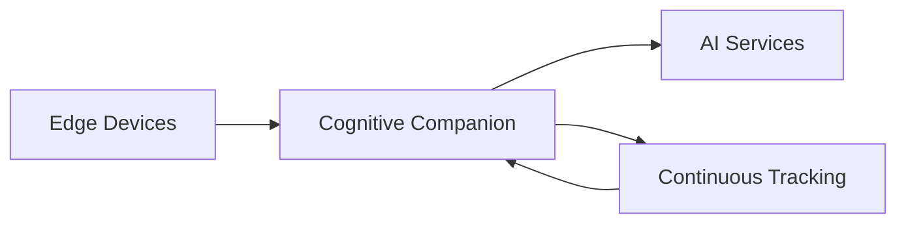

# Cognitive Companion

On-premise AI system for senior care: safety monitoring, activity tracking, and cognitive engagement. All inference runs locally.

The backend is a FastAPI BFF gateway for the continuous tracking, scene analysis, person identification, semantic memory, and TTS services. A Vue 3 admin UI provides camera management, a unified role-aware tracking workspace, live pipeline activity view, privacy zone configuration, rule authoring, and dementia signal dashboards. A senior-facing voice companion runs through the PWA.

**Documentation:** [silvermind-project.github.io](https://silvermind-project.github.io)

**Architecture reference:** [docs/systems-architecture.md](docs/systems-architecture.md) covers the sensors and integrations, the rules engine and trigger types, event aggregation, the plugin systems (steps, channels, filters), the PWA companion view, the Gemini Live realtime voice path, and a current bugs-and-gaps checklist.

## Architecture



The system ingests camera frames and sensor events, evaluates them against caregiver-authored rules with composable per-rule pipelines, and dispatches notifications across seven output channels. Person location state is managed by `PersonLocationService` as a single source of truth; MCP tools and BFF router endpoints read from the same service functions.

## Quick start

```bash
cp .env.example .env
docker compose -f docker-compose.db.yml -p nanai up -d  # shared Postgres
docker compose up -d
make init-db
```

See the [documentation site](https://silvermind-project.github.io) for person enrollment, pipeline configuration, and operations guides.

## Development

```bash
# Backend
uv run --project backend uvicorn backend.main:app --host 0.0.0.0 --port 8000 --reload

# Frontend
cd frontend && npm install && npm run dev

# Quality gates
make check              # lint + strict mypy on core + core tests
make check-all          # adds services tests
make test-integration   # integration tests (requires Docker)
```

## License

AGPL-3.0-or-later
