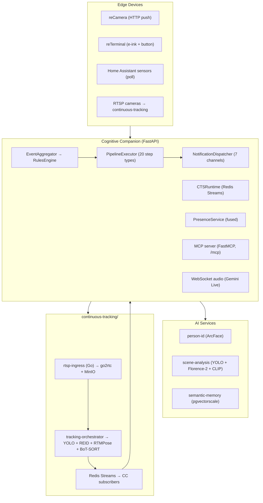

# Cognitive Companion

On-premise AI for senior care: safety monitoring, activity tracking, and cognitive engagement in a single system. All inference runs locally.

Documentation: [silvermind-project.github.io](https://silvermind-project.github.io). Agent reference: [AGENTS.md](AGENTS.md). Agent quick-start: [CLAUDE.md](CLAUDE.md).

---

## Architecture



Camera frames are batched by the EventAggregator and matched against rules whose context filters, dependencies, and rate limits pass. Each rule defines its own composable pipeline of steps. Notifications fan out to whichever channels the step config and `notifications.yaml` request.

Triggers are decoupled from rules: a rule can respond to multiple trigger types (cron schedules, sensor events, webhooks, Telegram commands, occupancy duration). Cron schedules use a dedicated `CronTrigger` model with many-to-many relationships, so multiple rules can share the same schedule. Rules can be exported to portable YAML/JSON bundles and imported across installations.

All template and condition expressions use a unified Lark-based grammar with `{{ }}` syntax supporting dotted paths, JMESPath pipes, comparisons, boolean operators, and built-in functions. Server-side validation catches typos and unknown paths at save time.

---

## Prerequisites

| Component | Purpose |
| --- | --- |
| Python 3.14, Node 18+ | Runtimes |
| PostgreSQL 18 (TimescaleDB + pgvectorscale) | Application database |
| MinIO (S3-compatible) | Media object storage |
| Home Assistant | Sensor integration + actions |
| NVIDIA GPU (10 GB+ VRAM) | Person-ID + vLLM + Triton |
| vLLM | Vision model serving |
| llama.cpp `llama-server` | General reasoning |
| Triton Inference Server | Embedding model for RAG |
| Docker + NVIDIA Container Toolkit | Container runtime |

Optional: `person-identification-service`, `scene-analysis-service`, `semantic-memory-service`, `tts-service`, `continuous-tracking/`, Telegram Bot, Google Gemini API.

---

## Quick start

```bash
# 1. Clone and configure
git clone https://github.com/SilverMind-Project/cognitive-companion.git
cd cognitive-companion
cp .env.example .env   # edit with your service URLs and API keys

# 2. Start shared PostgreSQL
docker compose -f docker-compose.db.yml -p nanai up -d

# 3. Start the app
docker compose up -d

# 4. Initialize database
make init-db

# 5. Open admin UI at http://<host>:8081/admin
```

For detailed setup including optional services, person enrollment, and pipeline configuration, see [Getting Started](https://silvermind-project.github.io/guide/getting-started).

### Local development

```bash
# Backend
uv run --project backend uvicorn backend.main:app --host 0.0.0.0 --port 8000 --reload

# Frontend
cd frontend && npm install && npm run dev   # http://localhost:5173
```

---

## Development

```bash
make check              # lint + strict mypy on core + core tests (fast gate)
make check-all          # adds services tests (required for service/schema changes)
make test               # full backend test suite
make typecheck-core     # strict mypy on backend.core
make typecheck          # full backend tree
make lint / make format # ruff
make migration          # autogenerate Alembic migration
make migrate            # apply pending migrations
```

Tests use a PostgreSQL testcontainer. Never mock the database.

### Plugin system

Add a pipeline step, notification channel, or context filter as a single file with a `@StepRegistry.register` decorator. The system discovers it at startup. No manual wiring needed.

```python
@StepRegistry.register
class YourStep(StepHandler):
    @classmethod
    def metadata(cls) -> StepMetadata:
        return StepMetadata(type_name="your_step", display_name="Your Step",
                            category="action", icon="mdi-star", description="...",
                            config_schema={}, default_config={},
                            output_schema={"type": "object", "properties": {
                                "your_key": {"type": "string"}
                            }})

    async def execute(self, step, execution, pipeline_data, trigger, services):
        return StepResult(data={"your_key": "value"})
```

Use `uv run --project backend python -m backend.steps._scaffold new your_step --category action` to generate a handler and test from a template.

Same pattern for `@ChannelRegistry.register` and `@FilterRegistry.register`. See [Extending the Pipeline](https://silvermind-project.github.io/development/extending-pipeline).

---

## Configuration

YAML in `config/` with `${ENV_VAR}` interpolation:

- `settings.yaml`: application settings, LLM models, polling intervals, CTS feature flag
- `auth.yaml`: API keys, device keys, fnmatch permission map
- `notifications.yaml`: alert-level to channel routing
- `presence.yaml`: PresenceService provider chain (priority-ordered)
- `knowledge_layouts.yaml`, `knowledge_voice.yaml`: info card and quiz configuration

`app.timezone` in settings.yaml is the single source of truth for timezone. DB stores UTC.

---

## API

REST API at `/api/v1`, MCP tools at `/mcp`. Full reference: [silvermind-project.github.io/api/reference](https://silvermind-project.github.io/api/reference).

---

## License

AGPL-3.0-or-later
