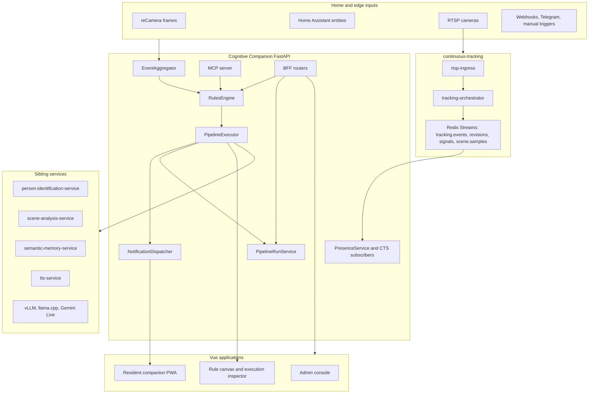

# Systems Architecture: Cognitive Companion

Cognitive Companion is an on-premise care automation and observability system. It ingests camera, Home Assistant, reCamera, and Continuous Tracking System events, evaluates caregiver-authored rules, runs graph-shaped pipelines, and delivers resident or caregiver feedback through local and outbound channels.

The code is the source of truth. This page reflects the current `cognitive-companion` backend and frontend after the pipeline canvas and unified observability milestones.

## System at a glance



## Runtime stack

| Layer | Current implementation |
| --- | --- |
| Backend | Python 3.14, FastAPI, SQLAlchemy 2.0, Pydantic 2, APScheduler |
| Frontend | Vue 3, Vuetify 3, Vite, vue-router, Vue Flow for the pipeline authoring canvas |
| Database | PostgreSQL 18 with Alembic migrations |
| Object storage | MinIO through an S3-compatible client |
| Realtime transport | WebSocket notifications, `/ws/pipeline` execution events, Gemini Live audio sessions |
| Local AI services | person ID, scene analysis, semantic memory, TTS, vLLM, llama.cpp, Triton embeddings |

## Backend layering

The backend follows a strict dependency direction.

```text
core/                    Foundational config, database, auth, time, logging, exceptions, templates
models/                  SQLAlchemy ORM tables
schemas/                 Pydantic HTTP and bundle schemas
integrations/            External clients and service adapters
services/                Business logic, orchestration, schedulers, CTS subscribers
steps/, channels/, filters/   Auto-discovered plugin systems
routers/                 Thin FastAPI BFF endpoints
mcp/                     MCP tools backed by the same service functions as routers
websocket/               Companion and pipeline WebSocket managers
main.py                  Lifespan wiring and service construction
```

Services are created once in `backend/main.py` during FastAPI lifespan and placed on `app.state`. Routers validate input, require permissions, call services, and return Pydantic schemas. New browser-visible BFF data should also be available through MCP by calling the same service function.

## Rules and graph pipelines

Rules are stored in `rules`. A rule has `trigger_types: list[str]`, optional cron trigger links, context filters, rule dependencies, rate limits, and a graph of pipeline steps.

Supported trigger types are:

| Trigger type | Source |
| --- | --- |
| `sensor_event` | reCamera, Home Assistant, or other sensor events |
| `cron` | APScheduler jobs linked through `rule_cron_triggers` |
| `manual` | `POST /api/v1/rules/{rule_id}/execute` |
| `webhook` | `POST /api/v1/webhooks/{rule_id}` with the rule secret |
| `telegram` | Telegram command polling |
| `occupancy_duration` | Sensor polling detects sustained occupancy |
| `cts_window` | CTS window trigger definitions |
| `dementia_signal` | CTS signal subscriber events |

### Authoring model

The current pipeline model is a directed graph:

| Table or schema | Purpose |
| --- | --- |
| `PipelineStep` | Step type, label, config, enabled flag, deterministic `order`, and canvas coordinates `position_x`, `position_y` |
| `PipelineEdge` | Directed connection from `source_step_id/source_port` to `target_step_id/target_port` |
| `StepMetadata.output_ports` | Ports a step can emit. Most steps emit `main`; `condition` emits `true` and `false` |
| `StepResult.output_ports` | Runtime ports activated by a step execution |

`PipelineEdge` enforces one outgoing edge per `(source_step_id, source_port)`. This makes branch behavior explicit and keeps the canvas and executor aligned.

### Execution model

When a rule fires, `PipelineExecutor`:

1. Creates a `WorkflowExecution`.
2. Builds initial `pipeline_data`, including `trigger` and localized `system` values.
3. Captures an immutable graph snapshot in `pipeline_data["_graph"]`.
4. Finds entry steps and executes enabled nodes according to graph edges.
5. Merges `StepResult.data` into `pipeline_data`.
6. Traverses only the output ports returned by the step.
7. Records `_step_timings`, including `step_id`, elapsed time, status, and `output_port`.
8. Marks waiting, completed, failed, or cancelled status.

The `wait` and `interactive_prompt` paths pause executions by setting `resume_at`. Cancel and rerun operations are exposed under `/api/v1/workflows/{execution_id}`.

## Unified execution observability

Execution observability has a deliberate API boundary:

| Surface | Purpose |
| --- | --- |
| `GET /api/v1/workflows/{execution_id}/detail` | Canonical rich execution detail for inspectors. Includes graph snapshot, timeline, resolved configs, outputs, errors, cancel and rerun flags |
| `GET /api/v1/pipeline/runs` | Lightweight recent or active run list for dashboards and live panels |
| `GET /api/v1/pipeline/runs/{execution_id}` | Lightweight run envelope for one execution |
| `/ws/pipeline` | Live step and pipeline lifecycle events with sequence numbers and `output_port` |

The Vue admin UI exposes one execution surface under `/admin/executions`. Compatibility routes redirect `/admin/workflows` to the history tab and `/admin/activity` to the live tab. `PipelineMonitorCanvas` can render live or historic executions, while `ExecutionInspector` fetches the canonical detail endpoint.

## Plugin systems

Pipeline steps, notification channels, and context filters are auto-discovered from `backend/steps/builtin`, `backend/channels/builtin`, and `backend/filters/builtin`.

### Step types

There are 24 registered built-in step types:

| Category | Step types |
| --- | --- |
| Perception and media | `person_identification`, `scene_analysis`, `media_window_poll`, `recamera_media_poll`, `cts_window_poll`, `image_crop`, `object_trend_analysis` |
| Presence and state | `presence_query`, `home_state`, `activity_detection`, `activity_session_start`, `activity_session_end`, `daily_report` |
| Knowledge | `semantic_memory_query`, `semantic_memory_write`, `info_card`, `quiz_start` |
| Reasoning and flow | `llm_call`, `condition`, `verification`, `wait`, `interactive_prompt` |
| Actions | `notification`, `ha_action` |

Every data-emitting step declares `StepMetadata.output_schema`. The step metadata endpoint exposes `config_schema`, `ui_hints`, `output_schema`, tags, and `output_ports` to the frontend.

`cts_window_poll` and `recamera_media_poll` are backward-compatible aliases of
the canonical `media_window_poll` handler.

### Channels

There are 7 channel types:

`pwa_popup_text`, `pwa_realtime_ai`, `pwa_tts_announcement`, `telegram`, `eink`, `ha_speaker_tts`, `webhook`.

### Context filters

There are 13 context filter types:

`room`, `time_range`, `day_of_week`, `person_presence`, `person_activity`, `room_transition`, `person_movement_memory`, `scene_contains`, `scene_trend`, `home_state`, `presence_status`, `presence_dwell`, `dementia_signal`.

## Template and import contracts

Pipeline configs use the Lark-based `{{ }}` expression grammar in `backend/core/template_grammar.lark`. Template validation runs when a step is saved, when a rule is imported, and through `POST /api/v1/rules/{rule_id}/validate`.

Rules export and import as portable bundles with label-based cross references. Bundles include step coordinates and graph edges so authored canvases survive round trips across installations.

## CTS integration boundary

Cognitive Companion consumes CTS through subscribers, read models, and upstream clients. CTS table writes are isolated under `backend/services/cts/`. Shared CTS helpers are imported from `backend/services/cts/_time.py`, `backend/services/cts/_types.py`, and `backend/routers/cts_deps.py`.

The primary CTS data paths are:

| Path | Purpose |
| --- | --- |
| `tracking.events` | Current location and PH observation updates |
| `tracking.revisions` | Identity correction propagation |
| `tracking.signals` | Dementia and routine-change signals |
| `scene.samples` | Scene samples for timeline and analysis surfaces |
| CTS routers | Camera admin, calibration, PH correction, presence, signals, trajectory, and dashboard endpoints |

## Frontend surfaces

| Surface | Role |
| --- | --- |
| `/admin/rules/{id}` | Rule settings, context filters, dependencies, graph canvas, step config |
| `/admin/executions` | Unified live and history execution observability |
| `/companion` | Resident-facing PWA widgets, voice, popups, TTS announcements |
| CTS admin views | Camera calibration, identity review, live tracking, signals, presence |
| Knowledge views | Documents, generated images, info cards, quizzes, delivery history |

Frontend code uses Vuetify design tokens from `frontend/src/styles/theme.css`. Read-only charts use ECharts shared components. Vue Flow is reserved for the interactive pipeline authoring canvas.

### Marauder's Map mode

The admin UI includes an optional cosmetic mode, "Marauder's Map," that re-skins the entire admin console to a parchment and hand-drawn aesthetic. It is a pure client-side feature with no backend endpoints, no database schema, and no contract impact.

Key properties:

- Implemented as a third registered Vuetify theme (`ccMarauders`) alongside the standard `ccDark` and `ccLight` themes.
- Toggled per user; state persists in `localStorage` under the key `cc_marauders`. The user's prior theme is captured in `cc_theme` and restored on toggle-off.
- All theme-specific render code lives under `components/marauders/`, `composables/useMaraudersMode.js`, `composables/useRoughSketch.js`, `composables/useFootprintTrail.js`, `styles/marauders.css`, and `assets/marauders/`. Edits to existing primary files are limited to theme registration, the toggle mount, the global SVG defs mount, and one `v-if` per render seam.
- Room polygons and bounding boxes render as rough.js hand-drawn ink lines. Live person tracks render as fading footstep glyphs driven by real tracking data. The presence heatmap renders as themed ink stains. All images in the app receive a painterly SVG filter.

When the mode is off, the app is byte-for-byte the standard `ccDark` / `ccLight` experience. See the front-end skill's "Alternate themes and the Marauder's Map mode" section for implementation patterns and rules.

## Operational notes

- `config/settings.yaml` is the single source for application behavior and timezone.
- `config/auth.yaml` controls API keys, device keys, and permission patterns.
- Schema changes go through Alembic. Do not rely on `create_all` outside tests and local setup.
- Optional upstreams degrade explicitly with structured logs and typed empty values where documented.
- Required BFF contracts fail closed with typed errors. Do not fabricate required upstream fields for browser responses.
- Fast gates: `make check`.
- Broader non-integration gate: `make check-all`.
- Frontend builds require Node.js 24.16.x according to `frontend/package.json` and `.nvmrc`.
