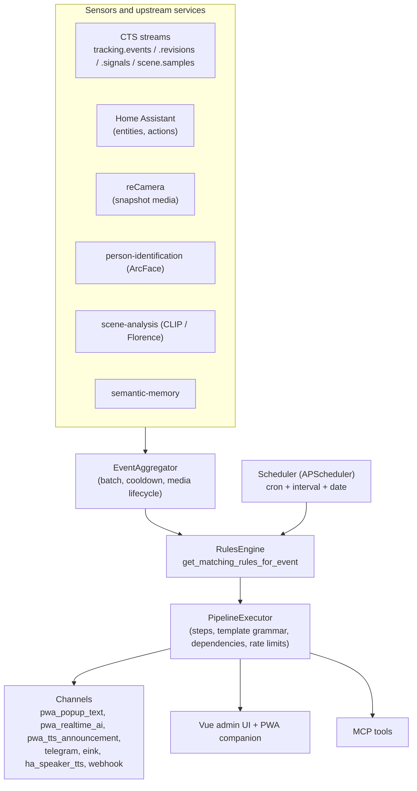
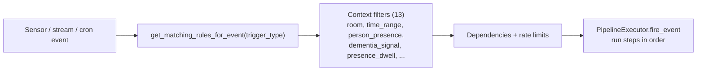
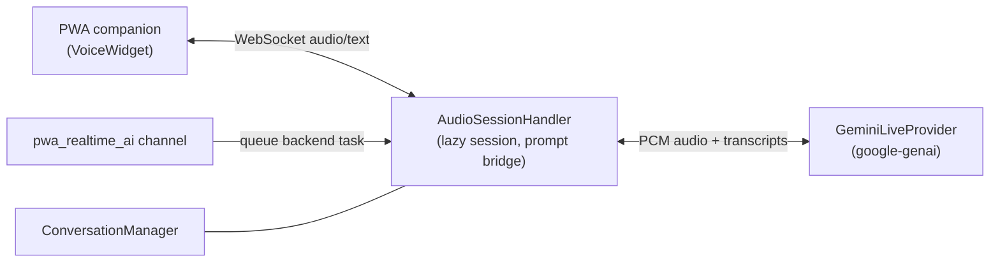

# Systems Architecture: Cognitive Companion (CC)

This is the CC-focused architecture reference: the sensor and actuator integrations, the rules engine and its trigger types, event aggregation, the plugin systems (steps, channels, filters), the progressive web app (PWA) companion view, the Gemini Live realtime voice path, and the known CC bugs and gaps. For the upstream tracking system (rtsp-ingress, tracking-orchestrator, the PersonHypothesis world tracker, and the identity model) see `continuous-tracking/docs/systems-architecture.md`.

The code is the source of truth. Counts and file references below were captured at one point in time; verify a named symbol still exists before relying on it. The "Bugs and gaps" section is a starting checklist, not a guarantee.

## What CC is

CC is a privacy-first, on-premise automation brain and BFF gateway (Python 3.14 FastAPI backend, Vue 3 + Vuetify frontend, PostgreSQL 18 shared TimescaleDB instance, port 8080). It does three things:

- **Ingests sensors**: cameras (via CTS), Home Assistant entities, reCamera snapshots, and upstream AI services.
- **Runs composable per-rule pipelines**: triggered by cron, sensor input, streams, webhooks, Telegram, or manual invocation, with shared context filters, dependencies, and rate limits.
- **Acts and informs**: notifications and announcements over seven channels, a live admin UI, MCP tools, and a realtime voice companion.

## Sensors and integrations

All integration clients live in `backend/integrations/` and degrade gracefully: when an upstream is disabled or unreachable they return `None`, `[]`, or a typed zero value; no exceptions bubble to callers.

| Integration | Client | Role |
|---|---|---|
| CTS (tracking orchestrator) | `tracking_orchestrator_client.py` | PH endpoints, identity correction proxy |
| CTS ingress | `ingress_admin_client.py` | camera registration / admin |
| Home Assistant | `homeassistant.py`, `ha_state_cache.py` | sensor state + actions (`ha_action` step, `ha_speaker_tts` channel) |
| Person identification | `person_id_client.py` | ArcFace face recognition |
| Scene analysis | `scene_analysis_client.py` | CLIP / Florence scene captions |
| Semantic memory | `semantic_memory_client.py` | RAG queries / writes |
| TTS | `tts.py` | speech synthesis |
| Telegram | `telegram.py` | caregiver messaging + trigger |
| Triton embeddings | `triton_embedding_client.py` | knowledge RAG embeddings |
| MinIO | `minio_client.py` | media object storage |
| Gemini Live | `llm/gemini_live.py` | realtime bidirectional voice |
| LLM chain | `llm/` (`ollama`, `openai_compat`, `chain`) | vision (vLLM) + reasoning (llama.cpp / Gemma) |
| eink | `eink_renderer.py` | e-ink display rendering |

reCamera is a first-class sensor source: low-resolution reCamera frames trigger rules, and a pipeline step then pulls higher-quality CTS data or reCamera snapshots (see the poll steps below).

## Rules engine, triggers, and event aggregation

Triggers are decoupled from rules. A `Rule` stores `trigger_types: list[str]` (JSON column). `RulesEngine.get_matching_rules_for_event(trigger_type=...)` (`backend/services/rules_engine.py`) selects rules whose `trigger_types` contains the fired type. One rule can serve several trigger types.

| Trigger type | Mechanism |
|---|---|
| `sensor_event` | RulesEngine matches rules on a sensor/stream event |
| `cron` | `Scheduler` (`scheduler.py`) creates one APScheduler job per `CronTrigger` row; on fire it dispatches all rules linked through `rule_cron_triggers` |
| `webhook` | `POST /webhooks/{rule_id}` with a configured secret |
| `telegram` | `TelegramTriggerService` polls commands |
| `manual` | `POST /rules/{id}/execute` |
| `occupancy_duration` | RulesEngine with an occupancy-minutes filter |
| `dementia_signal` | `DementiaSignalSubscriber` consumes CTS `tracking.signals` and fires rules with a dict event (sensor-dependent filters skipped) |

**Event aggregation** (`backend/services/event_aggregator.py`): per-sensor motion and capture events are batched into windows with cooldowns, and the media lifecycle (upload, cache, expire, delete) is managed via `MediaCache` and MinIO. On flush, a process callback runs the rule pipeline. Context filters (13), dependencies, and rate limits apply uniformly regardless of which trigger fired.

## Plugin systems (auto-discovered)

Drop one file under `backend/steps/builtin/`, `backend/channels/builtin/`, or `backend/filters/builtin/` with the matching `@*Registry.register` decorator; no manual wiring. Pipeline behaviour lives in `PipelineStep.config_json`, never in code that branches by rule name. Every data-emitting step must declare an `output_schema` in its `StepMetadata` (enforced by `backend/tests/steps/test_registry_contract.py`).

- **Step types (23 registered)**: `activity_detection`, `activity_session_start`, `activity_session_end`, `condition`, `cts_window_poll`, `daily_report`, `ha_action`, `home_state`, `image_crop`, `info_card`, `interactive_prompt`, `llm_call`, `notification`, `object_trend_analysis`, `person_identification`, `presence_query`, `quiz_start`, `recamera_media_poll`, `scene_analysis`, `semantic_memory_query`, `semantic_memory_write`, `verification`, `wait`. (CLAUDE.md and AGENTS.md list 20 and omit `cts_window_poll`, `recamera_media_poll`, and `image_crop`; that is a doc gap, see Bugs and gaps.)
- **Channels (7)**: `pwa_popup_text`, `pwa_realtime_ai`, `pwa_tts_announcement`, `telegram`, `eink`, `ha_speaker_tts`, `webhook`. (File names differ from channel names: `realtime_voice.py` registers `pwa_realtime_ai`, `announcement.py` registers `pwa_tts_announcement`, `tts.py` registers `ha_speaker_tts`, `websocket.py` registers `pwa_popup_text`.)
- **Filters (13)**: `room`, `time_range`, `day_of_week`, `person_presence`, `person_activity`, `room_transition`, `person_movement_memory`, `scene_contains`, `scene_trend`, `home_state`, `presence_status`, `presence_dwell`, `dementia_signal`.

### The reCamera / CTS-window pattern

Two newer step types implement a low-resolution-trigger, high-quality-analysis pattern:

- `cts_window_poll` (`steps/builtin/cts_window_poll.py`): pulls a window of recent CTS frames enriched with detections, identities, room dwells, and optional scene captions. Designed so a reCamera trigger can drive an LLM step that reasons over high-quality CTS data.
- `recamera_media_poll` (`steps/builtin/recamera_media_poll.py`): a snapshot step that returns recent reCamera images (presigned MinIO URLs) from the `EventAggregator` cache. Its output is intentionally symmetric with the `cts_window` trigger payload so downstream templates are identical across both camera paths.
- `image_crop` (`steps/builtin/image_crop.py`): crops images in the pipeline (the `docs/pipeline-image-crop` asset documents it).

## Pipeline execution and the template grammar

A rule firing flows `workflow.py` to `rules_engine.py` to `pipeline_executor.py`. Steps read and write `pipeline_data`; cross-step references use a single Lark-based `{{ }}` template grammar (`backend/core/template_grammar.lark`, evaluated by `template_interpreter.py`). Bare expressions without braces are not supported. JMESPath uses pipe syntax (`steps.foo.outputs.detections | length(@)`). Template expressions are validated server-side at save time (`services/template_validator.py`); invalid references are rejected with HTTP 422.

Rules export and import as portable YAML/JSON bundles (`services/rule_serializer.py`, `schemas/rule_bundle.py`) with label-based cross-references; plugins declare `ConfigMigration` chains for version upgrades.

## The PWA companion view

The companion is a separate Vue view (`frontend/src/views/CompanionView.vue`) composed of widgets (`frontend/src/components/companion/`, including `VoiceWidget.vue`). It is the resident-facing surface (distinct from the caregiver/admin UI under `/admin`):

- A configurable widget layout (main column and sidebar) driven by widget descriptors; widgets receive props and events via `getWidgetProps` / `getWidgetEvents`.
- A persistent WebSocket connection (status shown in the header) for push notifications and realtime voice. A notification-only client holds the socket open without opening a Gemini session (see cost model below).
- `info_card`, `interactive_prompt`, and `quiz_start` steps render into the companion; the `pwa_popup_text` and `pwa_tts_announcement` channels deliver to it.

## Gemini Live realtime voice

CC supports bidirectional voice via Google Gemini Live, behind a provider abstraction so the backend is swappable.

- `RealtimeLLMProvider` / `RealtimeSession` (`integrations/llm/base.py`) is the abstraction; `GeminiLiveProvider` (`integrations/llm/gemini_live.py`) implements it using the optional `google-genai` dependency (lazy-imported). Config: `llm.realtime.api_key`, `llm.realtime.model`, `llm.realtime.keepalive_interval`.
- `AudioSessionHandler` (`websocket/audio_handler.py`) coordinates one client's session: receive audio/text, forward to the realtime backend lazily (only on first activity), relay audio and transcripts back, persist conversation history across reconnects, and bridge orchestrator prompts from the connection-manager queue into the per-session queue so an incoming prompt can wake an idle session.
- The `pwa_realtime_ai` channel (`channels/builtin/realtime_voice.py`) queues an interactive voice prompt onto the WebSocket backend task queue for delivery via the active Gemini Live session; the AI speaks and waits for a spoken reply.

**Cost model and reliability nuance**: the Gemini session is opened lazily and only while there is audio or prompt activity, so notification-only clients incur no realtime API cost. The trade-off: if no Gemini Live session is active when a `pwa_realtime_ai` prompt arrives, the prompt is silently dropped. The channel docstring recommends pairing it with `pwa_popup_text` or `telegram` for guaranteed delivery. Treat `pwa_realtime_ai` as best-effort.

## CTS surface isolation (consumer side)

CC must keep the CTS surface contained:
- Do not write CTS tables outside `backend/services/cts/`.
- Import `cts_enabled` from `backend/routers/cts_deps.py`; do not redefine it.
- Import time helpers (`ns_to_iso`, `parse_ts`, `ensure_aware`) from `backend/services/cts/_time.py`; never duplicate them.
- Use protocol types from `backend/services/cts/_types.py` for injected services; never `Any`.
- Do not subscribe to `tracking.*` or `scene.*` streams outside `CTSRuntime`.
- Import signal kinds (`ALL_SIGNAL_KINDS`) from `backend/services/cts/signal_config.py`; never hardcode the kind strings.

## Cross-cutting conventions

- **Services live in the lifespan** (`backend/main.py`), accessed via `request.app.state.<name>`; never instantiate in a router.
- **`backend.core` has zero upward dependencies** (strict mypy applies to it).
- **Single timezone source**: `app.timezone` in `config/settings.yaml`; DB stores UTC; display and scheduling use `ZoneInfo`; the frontend uses `services/timezone.js` (never `toLocaleString`).
- **Schema changes go through Alembic** (`make migration` then `make migrate`); `create_all` is for tests and dev only.
- **Permissions are mandatory**: every endpoint has an `auth.yaml` entry; tests override `get_auth_context`, not `require_permission`.
- **Visualization**: an ECharts foundation with `useChartTheme` and a set of shared chart components; never hand-roll a chart in the Vue UI.
- **No em-dashes in Markdown.**
- Gates: `make check` (fast), `make check-all` (services + frontend), `make test-integration` (Docker). venv: `backend/.venv`; never system Python.

## Bugs and gaps (verify against current code before acting)

These were observed while surveying the codebase. Each is a starting point: confirm the file and line, then decide whether it is a real defect, intended deferral, or already fixed.

| Area | Location | Observation | Impact / suggested action |
|---|---|---|---|
| Step docs | `CLAUDE.md`, `AGENTS.md` | 23 step types are registered; docs say 20 and omit `cts_window_poll`, `recamera_media_poll`, `image_crop` | Update the step list and counts; document the reCamera / CTS-window pattern. Add reCamera to the sensor/integration table. |
| Presence service | `services/presence/service.py:221,228` | `history` and `for_room` raise `NotImplementedError("... block 9 territory")` | If any router or step calls these, it 500s. Confirm no live caller, or implement, or return a typed empty result with a clear log. |
| Presence anchor rules | `services/presence/anchor_rules.py:54` | bare `raise NotImplementedError` | Confirm this branch is unreachable in production or implement it. |
| Daily report | `services/daily_report.py:243,398,411` | medication doses-due is a placeholder; LLM prose summary is a TODO; room-trend API call is a TODO | The daily report is partially implemented. Either complete or clearly mark the report sections as preliminary in the UI. |
| Activity session | `services/activity_session.py:181` | `room_id=None  # TODO resolve from room_name` | Activity sessions are not room-attributed; room-scoped queries on sessions will miss them. Resolve room_id at write time. |
| Activity timeline | `services/activity_timeline.py:163` | `person_name=None  # TODO join with HouseholdMember` | Timeline entries show no person name. Join with `HouseholdMember`. |
| CTS presence timeline | `routers/cts_presence_timeline.py:106` | signals are a stub ("N7 adds full signal integration") | Dementia signals do not appear on the presence timeline. Wire `tracking.signals` into the timeline or mark the gap in the UI. |
| MCP conversation | `mcp/server.py:368` | recent conversation turns is a placeholder | MCP `get recent conversation` returns placeholder data. Implement against `ConversationManager` or remove the tool. |
| Realtime voice delivery | `channels/builtin/realtime_voice.py` | `pwa_realtime_ai` silently drops the prompt when no Gemini session is active | Best-effort by design, but easy to misconfigure. Surface a metric/log on drop and document the pairing requirement in the rule UI. |
| Parallel identity paths | `services/person_tracking.py`, `services/cts/location_writer.py` (DEPRECATED R2), `steps/builtin/person_identification.py` (DEPRECATED R2) | CC `PersonTrackingService` and the CTS identity resolver run parallel identity paths (TD-007); CC-side location writing is deprecated in favor of `PersonLocationService` | Confirm `PersonLocationService` is the single source of truth and that no deprecated path still writes. Validate the CTS-to-CC identity flow end to end. |
| Persons API | `routers/persons.py:94,98` | `GET` person-location endpoint marked `deprecated=True` | Ensure the frontend uses the replacement (`GET /api/v1/persons/{id}/location`) and schedule removal. |

When you fix any of these, add a falsifiable test (success path, missing-service path, one edge case) per the engineering-standards skill, and update this table.
